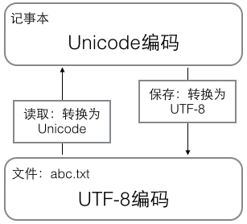
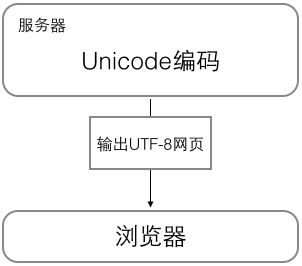

# python教程

## <font color = blue>python简介</font>

### <font color = DodgerBlue>适合利用Python开发的应用</font>

+ 首选是网络应用，包括网站、后台服务等等；
+ 其次是许多日常需要的小工具，包括系统管理员需要的脚本任务等等；
+ 另外就是把其他语言开发的程序再包装起来，方便使用。

### <font color = DodgerBlue>python优点</font>

+ 有非常完善的基础代码库和第三方库

+ “优雅”、“明确”、“简单”
+ Python是跨平台的，它可以运行在Windows、Mac和各种Linux/Unix系统上

### <font color = DodgerBlue>python缺点</font>

+ 运行速度慢

  和C程序相比非常慢，因为Python是解释型语言。代码在执行时会一行一行地翻译成CPU能理解的机器码，这个翻译过程非常耗时，所以很慢。而C程序是运行前直接编译成CPU能执行的机器码，所以非常快。

+ 代码不能加密。

  如果要发布你的Python程序，实际上就是发布源代码，这一点跟C语言不同，C语言不用发布源代码，只需要把编译后的机器码（也就是你在Windows上常见的xxx.exe文件）发布出去。要从机器码反推出C代码是不可能的，所以，凡是编译型的语言，都没有这个问题，而解释型的语言，则必须把源码发布出去。

### <font color = DodgerBlue>python解释器</font>

+ `CPython`

+ ` IPython`

+ `PyPy`

+ `Jython`

+ `IronPython`

  Python的解释器很多，但使用最广泛的还是`CPython`。如果要和Java或.Net平台交互，最好的办法不是用`Jython`或`IronPython`，而是通过网络调用来交互，确保各程序之间的独立性。


## <font color = blue>简单命令行交互指令</font>

+ 命令行模式

  `exit()`：退出python交互式环境

  `dir`：显示当前目录

  `more + file.name` 显示文件内容

+ Python交互式环境

  **在命令行模式运行`.py`文件和在Python交互式环境下直接运行Python代码有所不同**。Python交互式环境会把每一行Python代码的结果自动打印出来，但是，直接运行Python代码却不会。

  Python交互模式的代码是输入一行，执行一行，而命令行模式下直接运行`.py`文件是一次性执行该文件内的所有代码。**可见，Python交互模式主要是为了调试Python代码用的，也便于初学者学习，它*不是*正式运行Python代码的环境！**


## <font color = blue>语言基础</font>

### <font color = DodgerBlue>基本数据类型</font>

#### 整型  

+ 十六进制 `0x`前缀
+ 注意：**Python的整数没有大小限制**，而某些语言的整数根据其存储长度是有大小限制的，例如Java对32位整数的范围限制在`-2147483648`-`2147483647`。

#### 浮点数

+ 科学计数法， 10用e代替

+ 整数和浮点数在计算机内部存储的方式是不同的，整数运算永远是精确的（除法难道也是精确的？是的！），而浮点数运算则可能会有四舍五入的误差。

+ 整数的除法为什么是精确的?

  + `/`除法计算结果是浮点数，即使是两个整数恰好整除，结果也是浮点数

  + 还有一种除法是`//`，称为地板除，两个整数的除法仍然是整数

  + 余数运算`%`，可以得到两个整数相除的余数

    无论整数做`//`除法还是取余数，结果永远是整数，所以，整数运算结果永远是精确的。

    ```python
    print(10 / 3)
    print(10 // 3)
    print(10 % 3)
    ```

+ **Python的浮点数也没有大小限制**，但是超出一定范围就直接表示为`inf`（无限大）。

#### 字符串

+ 字符串是以单引号`'`或双引号`"`括起来的任意文本，比如`'abc'`，`"xyz"`等等。注意，`''`或`""`本身只是一种表示方式，不是字符串的一部分，因此，字符串`'abc'`只有`a`，`b`，`c`这3个字符。如果`'`本身也是一个字符，那就可以用`""`括起来，比如`"I'm OK"`包含的字符是`I`，`'`，`m`，空格，`O`，`K`这6个字符

+ 如果字符串内部既包含`'`又包含`"`可以用转义字符`\`来标识如`'I\'m \"OK\"!'表示`I'm "OK"!`

+ 用`r' '`表示`' '`内部的字符串默认不转义，如`print(r'\\\t\\')`表示`\\\t\\`

+ 允许用`'''...'''`的格式表示多行内容，多行字符串`'''...'''`还可以在前面加上`r`使用。

  ```python
  print(0xff)
  print(1.23e9)
  print('I\'m \"OK\"!')
  print('\\\t\\')
  print(r'\\\t\\')
  
  #多行输入
  print('''line1
  line2
  line3''')
  
  # 多个字符串输出，用逗号隔开，遇到逗号“,”会输出一个空格
  print('The quick brown fox', 'jump over', 'the lazy dog')
  name = input('Please enter your name:')
  print('hello', name)
  ```

#### 布尔值

+ 一个布尔值只有`True`、`False`两种值，要么是`True`，要么是`False`，在Python中，可以直接用`True`、`False`表示布尔值（注意大小写）
+ 布尔值可以用`and`、`or`和`not`运算

#### 空值

+ 空值是Python里一个特殊的值，用`None`表示。
+ `None`不能理解为`0`，因为`0`是有意义的，而`None`是一个特殊的空值。

#### 变量

+ 变量本身类型不固定的语言称为*动态语言*，与之对应的是*静态语言*，和静态语言相比，动态语言更灵活。

+ 静态语言在定义变量时必须指定变量类型，如果赋值的时候类型不匹配，就会报错。例如Java是静态语言。

+ 变量在计算机内存中的表示也非常重要，例如`a = 'ABC'`，Python解释器干了两件事情

  1. 在内存中创建了一个`'ABC'`的字符串；

  2. 在内存中创建了一个名为`a`的变量，并把它指向`'ABC'`。

     也可以把一个变量`a`赋值给另一个变量`b`，这个操作实际上是把变量`b`指向变量`a`所指向的数据。

+ Python支持多种数据类型，在计算机内部，可以把任何数据都看成一个“对象”，而变量就是在程序中用来指向这些数据对象的，对变量赋值就是把数据和变量给关联起来。

+ 对变量赋值`x = y`是把变量`x`指向真正的对象，该对象是变量`y`所指向的。随后对变量`y`的赋值*不影响*变量`x`的指向。

#### 常量

+ 在Python中，习惯上用全部大写的变量名表示常量。

#### 列表

+ list是一种有序的集合，可以随时添加和删除其中的元素。

+ 当索引超出了范围时，Python会报一个`IndexError`错误，所以，要确保索引不要越界，记得最后一个元素的索引是`len(classmates) - 1`。

+ 如果一个list中一个元素也没有，就是一个空的list，它的长度为0

  ```python
  #列表定义
  classmates = ['Michael', 'Bob', 'Tracy']
  print(classmates)
  
  #用len()函数可以获得list元素的个数
  print(len(classmates))
  
  #用索引来访问list中每一个位置的元素，记得索引是从0开始的
  print(classmates[0])
  
  #如果要取最后一个元素，除了计算索引位置外，还可以用-1做索引，直接获取最后一个元素
  print(classmates[-1])
  
  #list是一个可变的有序表，所以，可以往list中追加元素到末尾
  classmates.append('Adam')
  print(classmates)
  
  #也可以把元素插入到指定的位置，比如索引号为1的位置
  classmates.insert(1, 'Jack')
  
  #要删除list末尾的元素，用pop()方法：
  classmates.pop()
  
  #要把某个元素替换成别的元素，可以直接赋值给对应的索引位置
  classmates[1] = 'Sarah'
  
  #list里面的元素的数据类型也可以不同
  L = ['Apple', 123, True]
  
  #list元素也可以是另一个list，要注意s只有4个元素，其中s[2]又是一个list，要拿到'php'可以写s[2][1]，因此s可以看成是一个二维数组。
  s = ['python', 'java', ['asp', 'php'], 'scheme']
  print(len(s))
  ```

+ str是不变对象，而list是可变对象

  **对于不变对象来说，调用对象自身的任意方法，也不会改变该对象自身的内容。相反，这些方法会创建新的对象并返回，这样，就保证了不可变对象本身永远是不可变的。**

  ```python
  #对于可变对象，比如list，对list进行操作，list内部的内容是会变化的
  a = ['c', 'b', 'a']
  a.sort()
  print(a)
  
  #对于不可变对象，比如str，对str进行操作，虽然字符串有个replace()方法，也确实变出了'Abc'，但变量a最后仍是'abc'
  #要始终牢记的是，a是变量，而'abc'才是字符串对象！有些时候，我们经常说，对象a的内容是'abc'，但其实是指，a本身是一个变量，它指向的对象的内容才是'abc'
  #当我们调用a.replace('a', 'A')时，实际上调用方法replace是作用在字符串对象'abc'上的，而这个方法虽然名字叫replace，但却没有改变字符串'abc'的内容。相反，replace方法创建了一个新字符串'Abc'并返回，如果我们用变量b指向该新字符串，就容易理解了，变量a仍指向原有的字符串'abc'，但变量b却指向新字符串'Abc'了
  a = 'abc'
  b = a.replace('a', 'A')
  print(b)
  print(a)
  ```
  

#### 元组

+ 一种有序列表叫元组：tuple。tuple和list非常类似，但是tuple一旦初始化就不能修改，它也没有append()，insert()这样的方法。其他获取元素的方法和list是一样的，你可以正常地使用`classmates[0]`，`classmates[-1]`，但不能赋值成另外的元素。

+ 因为tuple不可变，所以代码更安全。如果可能，能用tuple代替list就尽量用tuple。

+ 对于“可变的”tuple，表面上看，tuple的元素确实变了，但其实变的不是tuple的元素，而是list的元素。tuple一开始指向的list并没有改成别的list，所以，tuple所谓的“不变”是说，tuple的每个元素，指向永远不变。即指向`'a'`，就不能改成指向`'b'`，指向一个list，就不能改成指向其他对象，但指向的这个list本身是可变的！

  ```python
  #元祖定义
  classmates = ('Michael', 'Bob', 'Tracy')
  print(classmates)
  
  #当你定义一个tuple时，在定义的时候，tuple的元素就必须被确定下来
  t = (1, 2)
  
  #如果要定义一个空的tuple，可以写成：
  t = ()
  
  #要定义一个只有1个元素的tuple
  t = (1,)
  
  #一个“可变的”tuple
  t = ('a', 'b', ['A', 'B'])
  t[2][0] = 'X'
  t[2][1] = 'Y'
  ```

#### 字典

+ Python内置了字典：dict的支持，dict全称dictionary，在其他语言中也称为map，使用键-值（key-value）存储，具有极快的查找速度。

  ```python
  #用dict实现一个“名字”-“成绩”的对照表，直接根据名字查找成绩，无论这个表有多大，查找速度都不会变慢。
  d = {'Michael': 95, 'Bob': 75, 'Tracy': 85}
  d['Michael']
  
  #把数据放入dict的方法，除了初始化时指定外，还可以通过key放入
   d['Adam'] = 67
   
  #由于一个key只能对应一个value，所以，多次对一个key放入value，后面的值会把前面的值冲掉;如果key不存在，dict就会报错
  d['Jack'] = 90
  d['Jack'] = 88
  #error
  d['Thomas']
  
  #要避免key不存在的错误，有两种办法，一是通过in判断key是否存在
  'Thomas' in d
  
  #二是通过dict提供的get()方法，如果key不存在，可以返回None，或者自己指定的value
  #返回None的时候Python的交互环境不显示结果
  d.get('Thomas')
  d.get('Thomas', -1)
  
  #要删除一个key，用pop(key)方法，对应的value也会从dict中删除
  d.pop('Bob')
  
  #要保证hash的正确性，作为key的对象就不能变。在Python中，字符串、整数等都是不可变的，因此，可以放心地作为key。而list是可变的，就不能作为key。
  #error
  key = [1, 2, 3]
  d[key] = 'a list'
  
  ```

+ 为什么dict查找速度这么快？因为dict的实现原理和查字典是一样的。假设字典包含了1万个汉字，我们要查某一个字，一个办法是把字典从第一页往后翻，直到找到我们想要的字为止，这种方法就是在list中查找元素的方法，list越大，查找越慢。

  第二种方法是先在字典的索引表里（比如部首表）查这个字对应的页码，然后直接翻到该页，找到这个字。无论找哪个字，这种查找速度都非常快，不会随着字典大小的增加而变慢。

  dict就是第二种实现方式，给定一个名字，比如`'Michael'`，dict在内部就可以直接计算出`Michael`对应的存放成绩的“页码”，也就是`95`这个数字存放的内存地址，直接取出来，所以速度非常快。

  key-value存储方式，在放进去的时候，必须根据key算出value的存放位置，这样，取的时候才能根据key直接拿到value。

+ **请务必注意，dict内部存放的顺序和key放入的顺序是没有关系的。**

+ 和list比较，dict有以下几个特点：

  + 查找和插入的速度极快，不会随着key的增加而变慢；

  + 需要占用大量的内存，内存浪费多。

  而list相反：

  + 查找和插入的时间随着元素的增加而增加；

  + 占用空间小，浪费内存很少。

  所以，dict是用空间来换取时间的一种方法。

  dict可以用在需要高速查找的很多地方，在Python代码中几乎无处不在，正确使用dict非常重要，需要牢记的第一条就是dict的key必须是**不可变对象**。

  这是因为dict根据key来计算value的存储位置，如果每次计算相同的key得出的结果不同，那dict内部就完全混乱了。这个通过key计算位置的算法称为哈希算法（Hash）。

#### 集合

+ set和dict类似，也是一组key的集合，但不存储value。由于key不能重复，所以，在set中，没有重复的key。

+ set和dict的**唯一区别仅在于**没有存储对应的value，但是，set的原理和dict一样，所以，同样不可以放入可变对象，因为无法判断两个可变对象是否相等，也就无法保证set内部“不会有重复元素”。

  ```python
  #要创建一个set，需要提供一个list作为输入集合
  #注意，传入的参数[1, 2, 3]是一个list，而显示的{1, 2, 3}只是告诉你这个set内部有1，2，3这3个元素，显示的顺序也不表示set是有序的
  s = set([1, 2, 3])
  print(s)
  
  #重复元素在set中自动被过滤
  s = set([1, 1, 2, 2, 3, 3])
  print(s)
  
  #通过add(key)方法可以添加元素到set中，可以重复添加，但不会有效果
  s.add(4)
  
  #通过remove(key)方法可以删除元素：
  s.remove(4)
  
  #set可以看成数学意义上的无序和无重复元素的集合，因此，两个set可以做数学意义上的交集、并集等操作
  s1 = set([1, 2, 3])
  s2 = set([2, 3, 4])
  s1 & s2
  {2, 3}
  s1 | s2
  {1, 2, 3, 4}
  ```


### <font color = DodgerBlue>输入和输出</font>

#### input

+ `input()`返回的数据类型是`str`，`str`不能直接和整数比较，必须先把`str`转换成整数。Python提供了`int()`函数来完成这件事情。注意`int()`函数发现一个字符串并不是合法的数字时就会报错。

```python
#error
birth = input('birth: ')
if birth < 2000:
    print('00前')
else:
    print('00后')
    
#right
s = input('birth: ')
birth = int(s)
if birth < 2000:
    print('00前')
else:
    print('00后')
```


###  <font color = DodgerBlue>字符串和编码</font>

#### ASCII、Unicode和UTF-8的关系

最早的计算机在设计时采用8个比特（bit）作为一个字节（byte），所以，一个字节能表示的最大的整数就是255（二进制11111111=十进制255），如果要表示更大的整数，就必须用更多的字节。比如两个字节可以表示的最大整数是`65535`，4个字节可以表示的最大整数是`4294967295`。

由于计算机是美国人发明的，因此，最早只有127个字符被编码到计算机里，也就是大小写英文字母、数字和一些符号，这个编码表被称为`ASCII`编码，比如大写字母`A`的编码是`65`，小写字母`z`的编码是`122`。

但是要处理中文显然一个字节是不够的，至少需要两个字节，而且还不能和ASCII编码冲突，所以，中国制定了`GB2312`编码，用来把中文编进去。可以想得到的是，全世界有上百种语言，日本把日文编到`Shift_JIS`里，韩国把韩文编到`Euc-kr`里，各国有各国的标准，就会不可避免地出现冲突，结果就是，在多语言混合的文本中，显示出来会有乱码。

因此，Unicode应运而生。Unicode把所有语言都统一到一套编码里，这样就不会再有乱码问题了。Unicode标准也在不断发展，但最常用的是用两个字节表示一个字符（如果要用到非常偏僻的字符，就需要4个字节）。现代操作系统和大多数编程语言都直接支持Unicode。

新的问题又出现了：如果统一成Unicode编码，乱码问题从此消失了。但是，如果你写的文本基本上全部是英文的话，用Unicode编码比ASCII编码需要多一倍的存储空间，在存储和传输上就十分不划算。

所以，本着节约的精神，又出现了把Unicode编码转化为“可变长编码”的`UTF-8`编码。`UTF-8`编码把一个Unicode字符根据不同的数字大小编码成1-6个字节，常用的英文字母被编码成1个字节，汉字通常是3个字节，只有很生僻的字符才会被编码成4-6个字节。如果你要传输的文本包含大量英文字符，用UTF-8编码就能节省空间。

UTF-8编码有一个额外的好处，就是ASCII编码实际上可以被看成是UTF-8编码的一部分，所以，大量只支持ASCII编码的历史遗留软件可以在UTF-8编码下继续工作。

#### 现在计算机系统通用的字符编码工作方式

+ 根据ASCII、Unicode和UTF-8的关系，总结一下现在计算机系统通用的字符编码工作方式：

+ 在计算机内存中，统一使用Unicode编码，当需要保存到硬盘或者需要传输的时候，就转换为UTF-8编码。

+ 用记事本编辑的时候，从文件读取的UTF-8字符被转换为Unicode字符到内存里，编辑完成后，保存的时候再把Unicode转换为UTF-8保存到文件：

  

+ 浏览网页的时候，服务器会把动态生成的Unicode内容转换为UTF-8再传输到浏览器，所以你看到很多网页的源码上会有类似``的信息，表示该网页正是用的UTF-8编码。

  

#### Python的字符串

在最新的Python 3版本中，字符串是以Unicode编码的，也就是说，Python的字符串支持多语言

```python
print('包含中文的str')
#对于单个字符的编码，Python提供了`ord()`函数获取字符的整数表示，`chr()`函数把编码转换为对应的字符
print(ord('A'))
print(ord('中'))
print(chr(25991))
#如果知道字符的整数编码，还可以用十六进制这么写`str`
print('\u4e2d\u6587')
```

由于Python的字符串类型是`str`，在内存中以Unicode表示，一个字符对应若干个字节。如果要在网络上传输，或者保存到磁盘上，就需要把`str`变为以字节为单位的`bytes`。Python对`bytes`类型的数据用带`b`前缀的单引号或双引号表示。

```python
#要注意区分`'ABC'`和`b'ABC'`，前者是`str`，后者虽然内容显示得和前者一样，但`bytes`的每个字符都只占用一个字节。
x = b'ABC'
#以Unicode表示的`str`通过`encode()`方法可以编码为指定的`bytes`
print('ABC'.encode('ascii'))
print('中文'.encode('utf-8'))
print('中文'.encode('gb2312'))
print('中文'.encode('ascii'))  #error
```

纯英文的`str`可以用`ASCII`编码为`bytes`，内容是一样的，含有中文的`str`可以用`UTF-8`编码为`bytes`。含有中文的`str`无法用`ASCII`编码，因为中文编码的范围超过了`ASCII`编码的范围，Python会报错。

在`bytes`中，无法显示为ASCII字符的字节，用`\x##`显示。

```python
#反过来，如果我们从网络或磁盘上读取了字节流，那么读到的数据就是`bytes`。要把`bytes`变为`str`，就需要用`decode()`方法：
print(b'ABC'.decode('ascii'))
print(b'\xe4\xb8\xad\xe6\x96\x87'.decode('utf-8'))
#如果bytes中包含无法解码的字节，decode()方法会报错
print( b'\xe4\xb8\xad\xff'.decode('utf-8'))
#如果bytes中只有一小部分无效的字节，可以传入errors='ignore'忽略错误的字节
print(b'\xe4\xb8\xad\xff'.decode('utf-8', errors='ignore'))
#要计算str包含多少个字符，可以用len()函数：
print(len('ABC'))
print(len('中文'))
#len()函数计算的是str的字符数，如果换成bytes，len()函数就计算字节数,
#1个中文字符经过UTF-8编码后通常会占用3个字节，而1个英文字符只占用1个字节
print(len(b'ABC'))
print(len(b'\xe4\xb8\xad\xe6\x96\x87'))
print(len('中文'.encode('utf-8')))
```

在操作字符串时，我们经常遇到`str`和`bytes`的互相转换。为了避免乱码问题，应当始终坚持使用UTF-8编码对`str`和`bytes`进行转换。

由于Python源代码也是一个文本文件，所以，当你的源代码中包含中文的时候，在保存源代码时，就需要务必指定保存为UTF-8编码。当Python解释器读取源代码时，为了让它按UTF-8编码读取，我们通常在文件开头写上这两行：

```python
#!/usr/bin/env python3
# -*- coding: utf-8 -*-
```

+ 第一行注释是为了告诉Linux/OS X系统，这是一个Python可执行程序，Windows系统会忽略这个注释

+ 第二行注释是为了告诉Python解释器，按照UTF-8编码读取源代码，否则，你在源代码中写的中文输出可能会有乱码。

  申明了UTF-8编码并不意味着你的`.py`文件就是UTF-8编码的，必须并且要确保文本编辑器正在使用UTF-8 without BOM编码。如果`.py`文件本身使用UTF-8编码，并且也申明了`# -*- coding: utf-8 -*-`，打开命令提示符测试就可以正常显示中文。

+ 格式化

  `%`运算符就是用来格式化字符串的。在字符串内部，`%s`表示用字符串替换，`%d`表示用整数替换，`%f`表示浮点数，`%x`表示十六进制整数。有几个`%?`占位符，后面就跟几个变量或者值，顺序要对应好。如果只有一个`%?`，括号可以省略。

  ```python
  print('%2d-%02d' % (3, 1))
  print('%.2f' % 3.1415926)
  #如果你不太确定应该用什么，`%s`永远起作用，它会把任何数据类型转换为字符串**
  print('Age: %s. Gender: %s' % (25, True))
  #有些时候，字符串里面的%是一个普通字符怎么办？这个时候就需要转义，用%%来表示一个%
  print('growth rate: %d %%' % 7)
  #另一种格式化字符串的方法是使用字符串的format()方法，它会用传入的参数依次替换字符串内的占位符{0}、{1}……，不过这种方式写起来比%要麻烦得多
  print('Hello, {0}, 成绩提升了 {1:.1f}%'.format('小明', 17.125))
  ```

  

## <font color = blue>基本流程控制</font>

### <font color = DodgerBlue>条件判断</font>

#### if基本语法

+ **注意不要少写了冒号`:`**

+ `if`语句执行有个特点，它是从上往下判断，如果在某个判断上是`True`，把该判断对应的语句执行后，就忽略掉剩下的`elif`和`else`

  ```python
  #根据Python的缩进规则，如果if语句判断是True，就把缩进的两行print语句执行了，否则，什么也不做。
  age = 20
  if age >= 18:
      print('your age is', age)
      print('adult')
  else:
      print('your age is', age)
      print('teenager')    
  
  #可以用elif做更细致的判断,elif是else if的缩写，完全可以有多个elif
  age = 3
  if age >= 18:
      print('adult')
  elif age >= 6:
      print('teenager')
  else:
      print('kid')
      
  ```

### <font color = DodgerBlue>循环</font>

#### for...in循环

+ `for x in ...`循环就是把每个元素代入变量`x`，然后执行缩进块的语句，依次把list或tuple中的每个元素迭代出来

  ```python
  #次打印names的每一个元素
  names = ['Michael', 'Bob', 'Tracy']
  for name in names:
      print(name)
      
  #计算1-10的整数之和，可以用一个sum变量做累加
  sum = 0
  for x in [1, 2, 3, 4, 5, 6, 7, 8, 9, 10]:
      sum = sum + x
  print(sum)
  
  #range()函数，可以生成一个整数序列，再通过list()函数可以转换为list
  list(range(5))
  
  #range(101)就可以生成0-100的整数序列
  sum = 0
  for x in range(10):
      sum = sum + x
  print(sum)
      
  ```

#### while循环

+ 只要条件满足，就不断循环，条件不满足时退出循环

  ```python
  #计算100以内所有奇数之和
  sum = 0
  n = 99
  while n > 0:
      sum = sum + n
      n = n - 2
  print(sum)
  ```

#### break语句

+ 在循环中，`break`语句可以提前退出循环

  ```python
  n = 1
  while n <= 100:
      if n > 10: # 当n = 11时，条件满足，执行break语句
          break # break语句会结束当前循环
      print(n)
      n = n + 1
  print('END')
  ```

#### continue语句

+ 通过`continue`语句，跳过当前的这次循环，直接开始下一次循环。

  ```python
  n = 0
  while n < 10:
      n = n + 1
      if n % 2 == 0: # 如果n是偶数，执行continue语句
          continue # continue语句会直接继续下一轮循环，后续的print()语句不会执行
      print(n)
  ```

+ `break`语句可以在循环过程中直接退出循环，而`continue`语句可以提前结束本轮循环，并直接开始下一轮循环。这两个语句通常都*必须*配合`if`语句使用。

+ *要特别注意*，不要滥用`break`和`continue`语句。`break`和`continue`会造成代码执行逻辑分叉过多，容易出错。大多数循环并不需要用到`break`和`continue`语句，上面的两个例子，都可以通过改写循环条件或者修改循环逻辑，去掉`break`和`continue`语句。


## <font color = blue>函数</font>

### <font color = DodgerBlue>调用函数</font>

+ 函数就是最基本的一种代码抽象的方式，

+ Python[内置了很多有用的函数](https://docs.python.org/3.9/library/functions.html)，我们可以直接调用，可以在交互式命令行通过`help(abs)`查看`abs`函数的帮助信息。

  ```python
  print(abs(-100))
  
  #调用函数的时候，如果传入的参数数量不对，会报TypeError的错误，并且Python会明确地告诉你：abs()有且仅有1个参数，但给出了两个
  #error
  abs(1, 2)
  
  #如果传入的参数数量是对的，但参数类型不能被函数所接受，也会报TypeError的错误，并且给出错误信息：str是错误的参数类型
  #error
  abs('a')
  
  #而max函数max()可以接收任意多个参数，并返回最大的那个
  max(1, 2, -5, 100)
  
  #数据类型转换函数
  int('123')
  int(12.34)
  float('12.34')
  str(1.23)
  bool(1)
  bool('')
  bool(' ')
  
  #函数名其实就是指向一个函数对象的引用，完全可以把函数名赋给一个变量，相当于给这个函数起了一个“别名”
  a = abs  # 变量a指向abs函数
  a(-1)   # 所以也可以通过a调用abs函数
  
  #hex()函数把一个整数转换成十六进制表示的字符串
  hex(255)
  ```

### <font color = DodgerBlue>定义函数</font>

+ 在Python中，定义一个函数要使用`def`语句，依次写出函数名、括号、括号中的参数和冒号`:`，然后，在缩进块中编写函数体，函数的返回值用`return`语句返回

+ 请注意，函数体内部的语句在执行时，一旦执行到`return`时，函数就执行完毕，并将结果返回。因此，函数内部通过条件判断和循环可以实现非常复杂的逻辑。

+ 如果没有`return`语句，函数执行完毕后也会返回结果，只是结果为`None`。`return None`可以简写为`return`。

+ 如果把`my_abs()`的函数定义保存为`abstest.py`文件了，那么，可以在该文件的当前目录下启动Python解释器，用`from abstest import my_abs`来导入`my_abs()`函数，注意`abstest`是文件名（不含`.py`扩展名。

  ```python
  #my_abs()的函数定义
  def my_abs(x):
      if x >= 0:
          return x
      else:
          return -x
  
  #如果定义一个什么事也不做的空函数，可以用pass语句
  def nop():
      pass
  
  #pass语句什么都不做，那有什么用？实际上pass可以用来作为占位符，比如现在还没想好怎么写函数的代码，就可以先放一个pass，让代码能运行起来。pass还可以用在其他语句里，比如
  if age >= 18:
      pass
  
  
  #当传入了不恰当的参数时，内置函数abs会检查出参数错误，而定义的my_abs没有参数检查，会导致if语句出错，出错信息和abs不一样。所以，这个函数定义不够完善。修改一下my_abs的定义，对参数类型做检查，只允许整数和浮点数类型的参数。数据类型检查可以用内置函数isinstance()实现：
  def my_abs(x):
      if not isinstance(x, (int, float)):
          raise TypeError('bad operand type')
      if x >= 0:
          return x
      else:
          return -x
      
  #返回多个值
  import math
  def move(x, y, step, angle=0):
      nx = x + step * math.cos(angle)
      ny = y - step * math.sin(angle)
      return nx, ny
  #同时获得返回值
  x, y = move(100, 100, 60, math.pi / 6)
  	print(x, y)
  #其实这只是一种假象，Python函数返回的仍然是单一值,返回值是一个tuple！但是，在语法上，返回一个tuple可以省略括号，而多个变量可以同时接收一个tuple，按位置赋给对应的值，所以，Python的函数返回多值其实就是返回一个tuple，但写起来更方便。
  r = move(100, 100, 60, math.pi / 6)
  print(r)
  ```

### <font color = DodgerBlue>函数的参数</font>

Python的函数定义非常简单，但灵活度却非常大。除了正常定义的必选参数外，还可以使用默认参数、可变参数和关键字参数，使得函数定义出来的接口，不但能处理复杂的参数，还可以简化调用者的代码。

#### 位置参数

```python
#对于power(x)函数，参数x就是一个位置参数。当我们调用power函数时，必须传入有且仅有的一个参数x
def power(x):
    return x * x
power(5)

#把power(x)修改为power(x, n)，用来计算x^n
def power(x, n):
    s = 1
    while n > 0:
        n = n - 1
        s = s * x
    return s
power(5, 3)
```

####  默认参数

+ 使用默认参数最大的好处是能降低调用函数的难度，而一旦需要更复杂的调用时，又可以传递更多的参数来实现。无论是简单调用还是复杂调用，函数只需要定义一个。默认参数可以简化函数的调用，设置默认参数时，有几点要注意：

  + 一是必选参数在前，默认参数在后，否则Python的解释器会报错（思考一下为什么默认参数不能放在必选参数前面）；

  + 二是如何设置默认参数。当函数有多个参数时，把变化大的参数放前面，变化小的参数放后面。变化小的参数就可以作为默认参数。

+ 有多个默认参数时，调用的时候，既可以按顺序提供默认参数，也可以不按顺序提供部分默认参数。当不按顺序提供部分默认参数时，需要把参数名写上。

+  **<font color = red>定义默认参数要牢记一点：默认参数必须指向不变对象！</font>**

+ 为什么要设计`str`、`None`这样的不变对象呢？因为不变对象一旦创建，对象内部的数据就不能修改，这样就减少了由于修改数据导致的错误。此外，由于对象不变，多任务环境下同时读取对象不需要加锁，同时读一点问题都没有。我们在编写程序时，如果可以设计一个不变对象，那就尽量设计成不变对象。

```python
#新的power(x, n)函数定义没有问题，但是，旧的调用代码失败了，原因是增加了一个参数，导致旧的代码因为缺少一个参数而无法正常调用
#Python的错误信息很明确：调用函数power()缺少了一个位置参数n
power(5)   #error

#这个时候，可以使用默认参数。由于经常计算x^2，所以，完全可以把第二个参数n的默认值设定为2。这样，当我们调用power(5)时，相当于调用power(5, 2)：
def power(x, n=2):
    s = 1
    while n > 0:
        n = n - 1
        s = s * x
    return s

#默认参数很有用，但使用不当，也会掉坑里。默认参数有个最大的坑
def add_end(L=[]):
    L.append('END')
    return L

add_end([1, 2, 3])         #[1, 2, 3, 'END']
add_end(['x', 'y', 'z'])   #['x', 'y', 'z', 'END']
#当你使用默认参数调用时，一开始结果也是对的
add_end()                  #['END']
#再次调用add_end()时，结果就不对了，默认参数是[]，但是函数似乎每次都“记住了”上次添加了'END'后的list
add_end()              #['END', 'END']
add_end()              #['END', 'END', 'END']

#Python函数在定义的时候，默认参数L的值就被计算出来了，即[]，因为默认参数L也是一个变量，它指向对象[]，每次调用该函数，如果改变了L的内容，则下次调用时，默认参数的内容就变了，不再是函数定义时的[]了。

#要修改上面的例子，我们可以用None这个不变对象来实现,无论调用多少次，都不会有问题
def add_end(L=None):
    if L is None:
        L = []
    L.append('END')
    return L
add_end()             #['END']
add_end()             #['END']
```

#### 可变参数

+ 在Python函数中，还可以定义可变参数。顾名思义，可变参数就是传入的参数个数是可变的，可以是1个、2个到任意个，还可以是0个。

+ 定义可变参数和定义一个list或tuple参数相比，仅仅在参数前面加了一个`*`号。在函数内部，参数`numbers`接收到的是一个tuple，因此，函数代码完全不变。

  ```python
  #计算a^2 + b^2 + c^2 + ……。要定义出这个函数，必须确定输入的参数。由于参数个数不确定，首先想到可以把a，b，c……作为一个list或tuple传进来，这样，函数可以定义如下：
  def calc(numbers):
      sum = 0
      for n in numbers:
          sum = sum + n * n
      return sum
  #调用的时候，需要先组装出一个list或tuple
  calc([1, 2, 3])
  calc((1, 3, 5, 7))
  
  #把函数的参数改为可变参数
  def calc(*numbers):
      sum = 0
      for n in numbers:
          sum = sum + n * n
      return sum
  #利用可变参数，调用函数的方式可以简化成这样
  calc(1, 2, 3)
  calc(1, 3, 5, 7)
  #调用该函数时，可以传入任意个参数，包括0个参数
  calc()
  #如果已经有一个list或者tuple，要调用一个可变参数可以这样做
  nums = [1, 2, 3]
  calc(nums[0], nums[1], nums[2])
  #这种写法当然是可行的，问题是太繁琐，所以Python允许你在list或tuple前面加一个*号，把list或tuple的元素变成可变参数传进去。*nums表示把nums这个list的所有元素作为可变参数传进去。这种写法相当有用，而且很常见。
  nums = [1, 2, 3]
  calc(*nums)
  ```

#### 关键字参数

+ 可变参数允许你传入0个或任意个参数，这些可变参数在函数调用时自动组装为一个tuple。而关键字参数允许你传入0个或任意个含参数名的参数，这些关键字参数在函数内部自动组装为一个dict。

+ 关键字参数有什么用？它可以扩展函数的功能。比如，在`person`函数里，我们保证能接收到`name`和`age`这两个参数，但是，如果调用者愿意提供更多的参数，我们也能收到。试想正在做一个用户注册的功能，除了用户名和年龄是必填项外，其他都是可选项，利用关键字参数来定义这个函数就能满足注册的需求。

  ```python
  #函数person除了必选参数name和age外，还接受关键字参数kw。
  def person(name, age, **kw):
      print('name:', name, 'age:', age, 'other:', kw)
  #在调用该函数时，可以只传入必选参数    
  person('Michael', 30)    # name: Michael age: 30 other: {}
  #也可以传入任意个数的关键字参数：
  person('Bob', 35, city='Beijing')   # Bob age: 35 other: {'city': 'Beijing'}
  person('Adam', 45, gender='M', job='Engineer')  
  #输出 name: Adam age: 45 other: {'gender': 'M', 'job': 'Engineer'}
  
  #和可变参数类似，也可以先组装出一个dict，然后，把该dict转换为关键字参数传进去
  extra = {'city': 'Beijing', 'job': 'Engineer'}
  person('Jack', 24, city=extra['city'], job=extra['job'])
  #输出 name: Jack age: 24 other: {'city': 'Beijing', 'job': 'Engineer'}
  
  #上面复杂的调用可以用简化的写法，**extra表示把extra这个dict的所有key-value用关键字参数传入到函数的**kw参数，kw将获得一个dict，注意kw获得的dict是extra的一份拷贝，对kw的改动不会影响到函数外的extra。
  extra = {'city': 'Beijing', 'job': 'Engineer'}
  person('Jack', 24, **extra)   
  #输出 name: Jack age: 24 other: {'city': 'Beijing', 'job': 'Engineer'}
  
  ```

#### 命名关键字参数

+ 对于关键字参数，函数的调用者可以传入任意不受限制的关键字参数。至于到底传入了哪些，就需要在函数内部通过`kw`检查。

+ 如果要**限制关键字参数的名字，就可以用命名关键字参数**。和关键字参数`**kw`不同，命名关键字参数需要一个特殊分隔符`*`，`*`后面的参数被视为命名关键字参数。

+ 使用命名关键字参数时，要特别注意，如果没有可变参数，就必须加一个`*`作为特殊分隔符。如果缺少`*`，Python解释器将无法识别位置参数和命名关键字参数。如果函数定义中已经有了一个可变参数，后面跟着的命名关键字参数就不再需要一个特殊分隔符`*`了

  ```python
  #仍以`person()`函数为例，希望检查是否有`city`和`job`参数：
  def person(name, age, **kw):
      if 'city' in kw:
          # 有city参数
          pass
      if 'job' in kw:
          # 有job参数
          pass
      print('name:', name, 'age:', age, 'other:', kw)
  #但是调用者仍可以传入不受限制的关键字参数：
  person('Jack', 24, city='Beijing', addr='Chaoyang', zipcode=123456)
  
  #用命名关键字参数，例如，只接收`city`和`job`作为关键字参数。这种方式定义的函数如下：
  def person(name, age, *, city, job):
      print(name, age, city, job)
  person('Jack', 24, city='Beijing', job='Engineer')
  #Jack 24 Beijing Engineer
  #如果函数定义中已经有了一个可变参数，后面跟着的命名关键字参数就不再需要一个特殊分隔符*了：
  def person(name, age, *args, city, job):
      print(name, age, args, city, job)
  #命名关键字参数必须传入参数名，这和位置参数不同。如果没有传入参数名，调用将报错。由于调用时缺少参数名city和job，Python解释器把这4个参数均视为位置参数，但person()函数仅接受2个位置参数。
  person('Jack', 24, 'Beijing', 'Engineer')   #error
  
  #命名关键字参数可以有缺省值，从而简化调用，
  def person(name, age, *, city='Beijing', job):
      print(name, age, city, job)
  #由于命名关键字参数city具有默认值，调用时，可不传入city参数：
  person('Jack', 24, job='Engineer')   #Jack 24 Beijing Engineer
  ```

#### 参数组合

+ 在Python中定义函数，可以用必选参数、默认参数、可变参数、关键字参数和命名关键字参数，这5种参数都可以组合使用。但是请注意，参数定义的顺序必须是：必选参数、默认参数、可变参数、命名关键字参数和关键字参数。

+ 对于任意函数，都可以通过类似func(*args, **kw)的形式调用它，无论它的参数是如何定义的。

+ 虽然可以组合多达5种参数，但不要同时使用太多的组合，否则函数接口的可理解性很差。

  ```python
  #定义一个函数，包含上述若干种参数：
  def f1(a, b, c=0, *args, **kw):
      print('a =', a, 'b =', b, 'c =', c, 'args =', args, 'kw =', kw)
  
  def f2(a, b, c=0, *, d, **kw):
      print('a =', a, 'b =', b, 'c =', c, 'd =', d, 'kw =', kw)
  #在函数调用的时候，Python解释器自动按照参数位置和参数名把对应的参数传进去。
  f1(1, 2)      # a = 1 b = 2 c = 0 args = () kw = {}
  f1(1, 2, c=3) # a = 1 b = 2 c = 3 args = () kw = {}
  f1(1, 2, 3, 'a', 'b')  # a = 1 b = 2 c = 3 args = ('a', 'b') kw = {}
  f1(1, 2, 3, 'a', 'b', x=99) #a = 1 b = 2 c = 3 args = ('a', 'b') kw = {'x': 99}
  f2(1, 2, d=99, ext=None)   # a = 1 b = 2 c = 0 d = 99 kw = {'ext': None}
  #通过一个tuple和dict，你也可以调用上述函数：
  args = (1, 2, 3, 4)
  kw = {'d': 99, 'x': '#'}
  f1(*args, **kw)  # a = 1 b = 2 c = 3 args = (4,) kw = {'d': 99, 'x': '#'}
  args = (1, 2, 3)
  kw = {'d': 88, 'x': '#'}
  f2(*args, **kw)   # a = 1 b = 2 c = 3 d = 88 kw = {'x': '#'}
  ```

#### 小结

+ Python的函数具有非常灵活的参数形态，既可以实现简单的调用，又可以传入非常复杂的参数。

+ **默认参数一定要用不可变对象，如果是可变对象，程序运行时会有逻辑错误！**

+ 要注意定义可变参数和关键字参数的语法：

  + `*args`是可变参数，args接收的是一个tuple；

  + `**kw`是关键字参数，kw接收的是一个dict。

  以及调用函数时如何传入可变参数和关键字参数的语法：

  + 可变参数既可以直接传入：`func(1, 2, 3)`，又可以先组装list或tuple，再通过`*args`传入：`func(*(1, 2, 3))`；

  + 关键字参数既可以直接传入：`func(a=1, b=2)`，又可以先组装dict，再通过`**kw`传入：`func(**{'a': 1, 'b': 2})`。

+ 使用`*args`和`**kw`是Python的习惯写法，当然也可以用其他参数名，但最好使用习惯用法。

+ 命名的关键字参数是为了限制调用者可以传入的参数名，同时可以提供默认值。定义命名的关键字参数在没有可变参数的情况下不要忘了写分隔符`*`，否则定义的将是位置参数。

### <font color = DodgerBlue>递归函数</font>


### <font color = DodgerBlue>递归函数</font>

+ 定义

  + 在函数内部，可以调用其他函数。如果一个函数在内部调用自身本身，这个函数就是递归函数。计算阶乘`n! = 1 x 2 x 3 x ... x n`，用函数`fact(n)`表示，可以看出：fact(n) = n! = 1 x 2 x 3 x ... x (n-1) x n = (n-1)! x n = fact(n-1) x n。所以，`fact(n)`可以表示为`n x fact(n-1)`，只有n=1时需要特殊处理。
  + 递归函数的优点是定义简单，逻辑清晰。理论上，所有的递归函数都可以写成循环的方式，但循环的逻辑不如递归清晰。

+ 优化

  + 使用递归函数需要注意防止栈溢出。在计算机中，函数调用是通过栈（stack）这种数据结构实现的，每当进入一个函数调用，栈就会加一层栈帧，每当函数返回，栈就会减一层栈帧。由于栈的大小不是无限的，所以，递归调用的次数过多，会导致栈溢出。可以试试`fact(1000)`

  + 解决递归调用栈溢出的方法是通过**尾递归**优化，事实上尾递归和循环的效果是一样的，所以，把循环看成是一种特殊的尾递归函数也是可以的。尾递归是指，在函数返回的时候，调用自身本身，并且，return语句不能包含表达式。这样，编译器或者解释器就可以把尾递归做优化，使递归本身无论调用多少次，都只占用一个栈帧，不会出现栈溢出的情况。

  + 尾递归调用时，如果做了优化，栈不会增长，因此，无论多少次调用也不会导致栈溢出。遗憾的是，大多数编程语言没有针对尾递归做优化，Python解释器也没有做优化，所以，即使把上面的`fact(n)`函数改成尾递归方式，也会导致栈溢出。

    ```python
    #fact(n)用递归的方式写出来就是
    def fact(n):
        if n==1:
            return 1
        return n * fact(n - 1)
    #上面的fact(n)函数由于return n * fact(n - 1)引入了乘法表达式，所以就不是尾递归了。要改成尾递归方式，需要多一点代码，主要是要把每一步的乘积传入到递归函数中。
    #可以看到，return fact_iter(num - 1, num * product)仅返回递归函数本身，num - 1和num * product在函数调用前就会被计算，不影响函数调用。
    #fact(5)对应的fact_iter(5, 1)的调用如下：
    #===> fact_iter(5, 1)
    #===> fact_iter(4, 5)
    #===> fact_iter(3, 20)
    #===> fact_iter(2, 60)
    #===> fact_iter(1, 120)
    #===> 120
    def fact(n):
        return fact_iter(n, 1)
    
    def fact_iter(num, product):
        if num == 1:
            return product
        return fact_iter(num - 1, num * product)
    ```

+ 小结

  + 使用递归函数的优点是逻辑简单清晰，缺点是过深的调用会导致栈溢出。
  + 针对尾递归优化的语言可以通过尾递归防止栈溢出。尾递归事实上和循环是等价的，没有循环语句的编程语言只能通过尾递归实现循环。
  + Python标准的解释器没有针对尾递归做优化，任何递归函数都存在栈溢出的问题。

  

  

  


